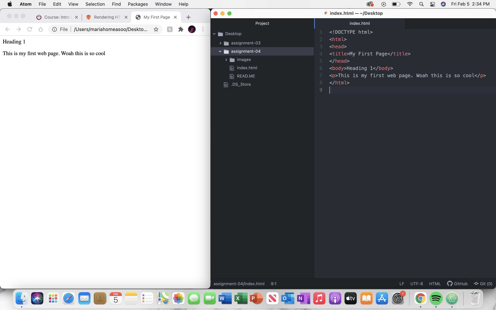

There are different components of a browser. The first is the user interface. This is what we see when using the browser. The second component is the rendering engine. This displays the visual representation of the page. The third is the browser engine. The browser engine directs actions between the rendering engine and the user interface and external communication. The browser communicating with the network is the next component. The fifth one is programming languages. Different browsers use different languages. The sixth component is data storage. Different browsers use different rendering engine. The network provides the engine the right document. Once the rendering engine gets the information it needs, it creates a DOM. Finally the node tree is created. The only browser I use is Google Chrome.

A markup language is a computer language that dictates a web page's architecture. A browser is a combination of text, design, and interactivity. A widely used language is Hypertext Markup Language or HTML. HTML is the foundation of a page's content and render's content and page structure.

