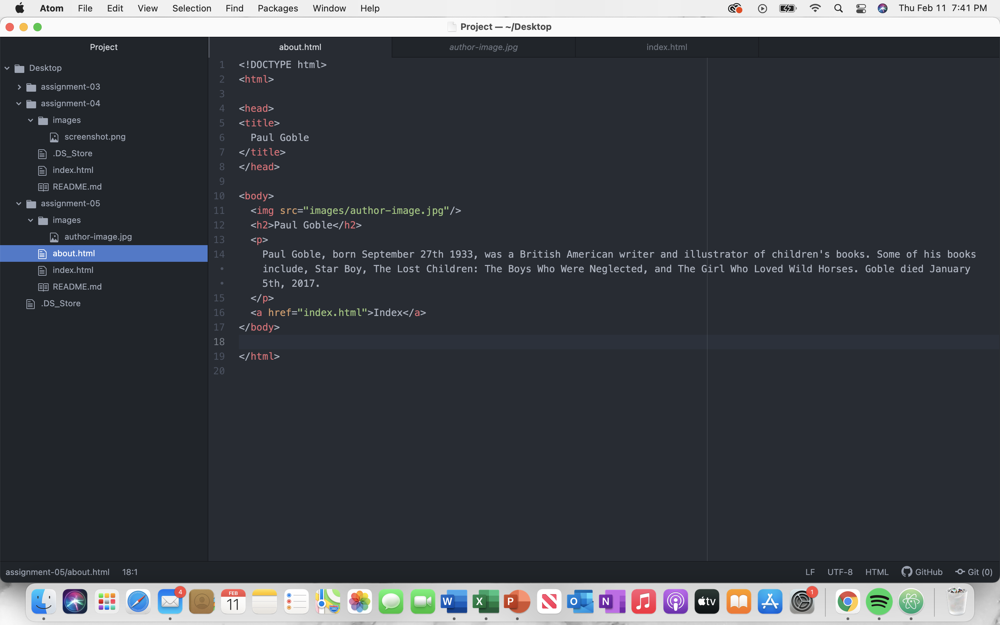

I visited YouTube. I looked at a snapshot from Feb. 12th, 2021 then compared it to a snapshot from Dec. 31st, 2005. It looked like YouTube. I don't think anyone can mistake it for a different sight, it's pretty easy to identify YouTube. The most notable change was the layout and the logo. Today trending, subscriptions, playlists, etc. are on the left side in a separate menu. In 2005, all of that was on the top. Maybe it's because I'm so used to it but I prefer how YouTube looks today over what it looked like in 2005.

So far I learned how to create repositories for homework. As well as manage directories, files, and upload all of it to GitHub. In addition I learned how to set up an actual page, which is pretty cool. I'm learning HTML, to be honest I was little scared and stressed out when we started coding. I don't really think it's all that difficult, the tutorials help out a lot. But I'm not saying it's super easy, it's a lot to get used to. This week I struggled a little with adding an image using HTML, but I figured it out.

